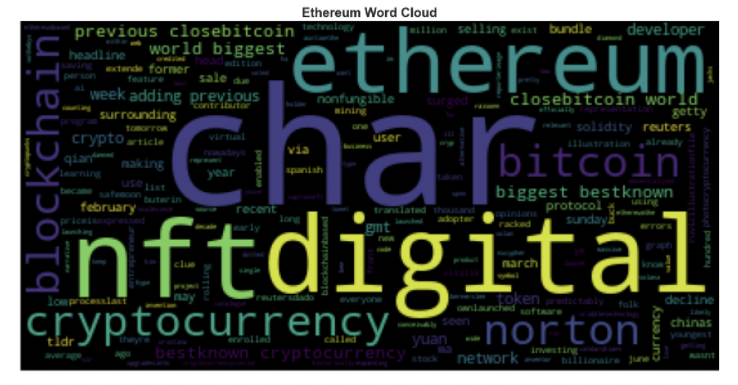
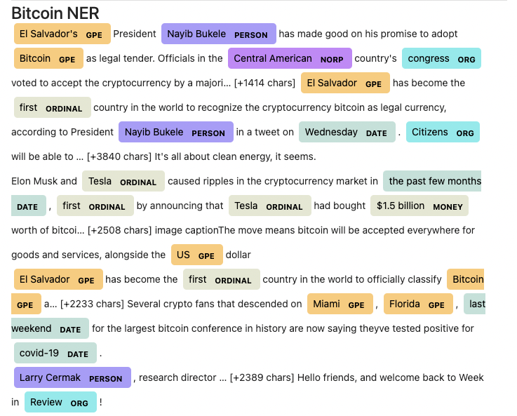
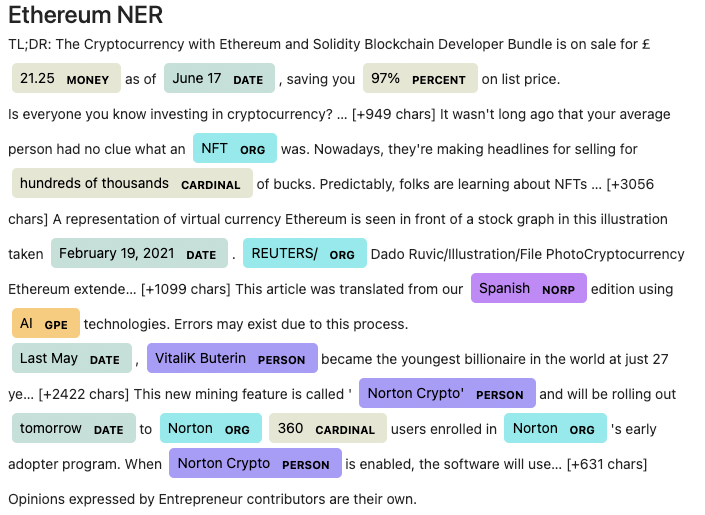

# Unit-12-Tales-from-the-Crypto

## Background

There's been a lot of hype in the news lately about cryptocurrency, so you want to take stock, so to speak, of the latest news headlines regarding Bitcoin and Ethereum to get a better feel for the current public sentiment around each coin.

In this assignment, you will apply natural language processing to understand the sentiment in the latest news articles featuring Bitcoin and Ethereum. You will also apply fundamental NLP techniques to better understand the other factors involved with the coin prices such as common words and phrases and organizations and entities mentioned in the articles.

Complete the following tasks:

1. Sentiment Analysis
2. Natural Language Processing
3. Named Entity Recognition

---
## Analysis

### 1 - Sentiment Analysis:

In this section, I used the newsapi to pull the latest news articles for Bitcoin and Ethereum and I have created a DataFrame of sentiment scores for each coin.

Then, I used descriptive statistics to answer the following questions:

> Which coin had the highest mean positive score?
A: Bitcoin with 6.41%

> Which coin had the highest negative score?
A: Bitcoin with 84%

> Which coin had the highest positive score?
A: Bitcoin with 28%

---
### 2 - Natural Language Processing:

In this section, I used NLTK and Python to tokenize text, find n-gram counts, and create word clouds for both coins. 

#### Tokenize-

I have done the following tasks for Tokenize:

1. Lowercase each word.
2. Remove punctuation.
3. Remove stop words.

#### N-grams-

I have looked at the ngrams and word frequency for each coin:

1. Use NLTK to produce the ngrams for N = 2.
2. List the top 10 words for each coin.

#### Word Clouds-

Finally, I have generated word clouds for each coin to summarize the news for each coin.

---

### 3 - Named Entity Recognition

In this section, I have built a named entity recognition model for both coins and visualize the tags using SpaCy.

